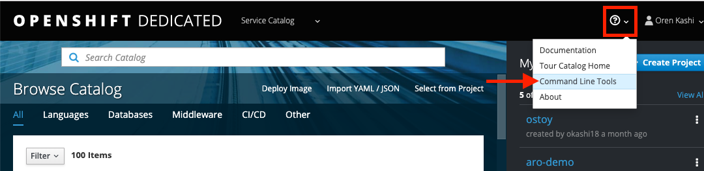

#### 1. A GitHub Account
You will need your own GitHub account for some portions of this lab.  If you do not already have a GitHub account please visit <https://github.com/join> to create your account.

#### 2. OC Command Line Interface

If you are doing the lab exercises from the terminal in the web browser, you can skip this step and move to the next module (Basic Concepts).

However, if you wish to run the labs from your machine, you will need to [download and install](https://docs.openshift.com/container-platform/4.8/cli_reference/openshift_cli/getting-started-cli.html#installing-openshift-cli) the latest OpenShift CLI (oc).  

> **NOTE:** You can access the command line tools page by clicking on the *Questionmark > Command Line Tools*:

**Why use `oc` over `kubectl`** 
Being Kubernetes, one can definitely use `kubectl` with their OpenShift cluster.  `oc` is specific to OpenShift in that it includes the standard set of features from `kubectl` plus additional support for OpenShift functionality.  See [Differences between OC and Kubectl](https://docs.openshift.com/container-platform/3.11/cli_reference/differences_oc_kubectl.html) for more details.

#### 3. Install Git

If you are doing the lab exercises from the terminal in the web browser, you can skip this step because git has already been installed in the terminal container.

However, if you wish to run the labs from your machine, you will need to install Git on your workstation.  See the official [Git documentation](https://git-scm.com/book/en/v2/Getting-Started-Installing-Git) for instructions per your workstation’s operating system.
