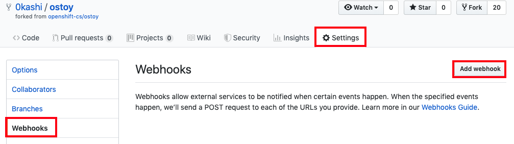
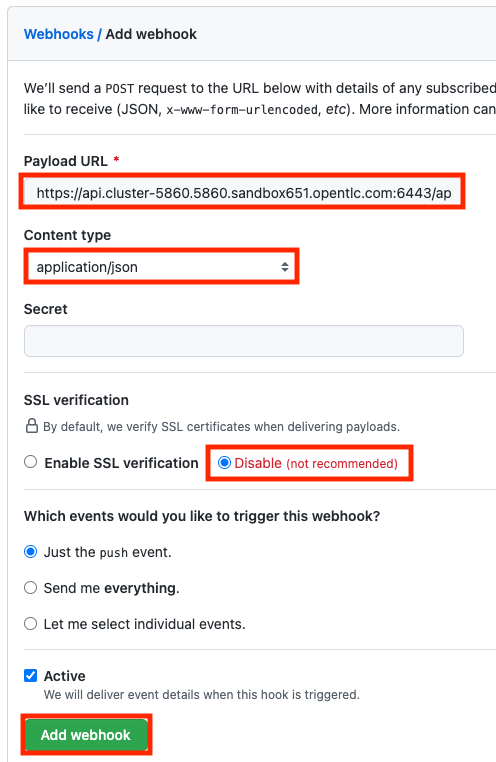
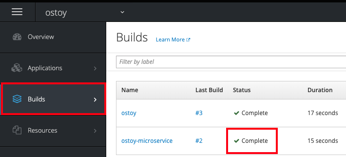
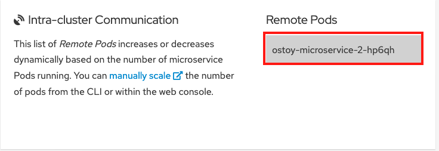

If we'd like to automatically trigger a build and deploy anytime we change the source code we can do that by using a webhook.

See [Triggering Builds](https://docs.openshift.com/dedicated/3/dev_guide/builds/triggering_builds.html) for more details.

#### 1. Get the trigger secret

Retrieve the GitHub webhook trigger secret using the command below. You’ll need use this secret in the GitHub webhook URL.

```execute
oc get bc/ostoy-microservice -o=jsonpath='{.spec.triggers..github.secret}'
```

You will get a response similar to:
`o_3x9M1qoI2Wj_czRWiK`

Set the secret in an environment variable:

```execute
WEBHOOK_SECRET="$(oc get bc/ostoy-microservice -o=jsonpath='{.spec.triggers..github.secret}')"
echo $WEBHOOK_SECRET
```

Note the secret as you will need to use it shortly.

#### 2. Retrieve the GitHub webhook trigger URL

You will need to get the GitHub webhook trigger url from the buildconfig.  Use following command to retrieve it

```execute
oc describe bc/ostoy-microservice
```

You will get a response with much data but look for the line that looks like

```shell
Webhook GitHub:
	URL:	https://172.30.0.1:443/apis/build.openshift.io/v1/namespaces/%username%-ostoy-s2i/buildconfigs/ostoy-microservice/webhooks/<secret>/github
```

The address of the URL is set to `172.30.0.1` because we are accessing OpenShift from within the cluster. If we were to use the `oc` CLI from outside the cluster, it would look like the following:

`%API_URL%/apis/build.openshift.io/v1/namespaces/%username%-ostoy-s2i/buildconfigs/ostoy-microservice/webhooks/<secret>/github`

#### 3. Generate the webhook URL with secret

```execute
echo && \
echo "Copy the following URL:" && \
echo "%API_URL%/apis/build.openshift.io/v1/namespaces/%username%-ostoy-s2i/buildconfigs/ostoy-microservice/webhooks/${WEBHOOK_SECRET}/github" && \
echo
```

Copy the generated URL to your clipboard. You will need it in the next step.

#### 4. Setup the webhook URL in GitHub repository

- In your repository, click on *Settings > Webhooks > Add webhook*



- Paste the URL from step 4 into the "Payload URL" field
- Change the "Content type" to `application/json`
- Disable SSL verification (this is required because Github does not recognize the cluster API server's certificate)
- Click add webhook at the bottom



You should see a message from GitHub stating that your webhook was successfully configured. Now, whenever you push a change to your GitHub repository, a new build will automatically start, and upon a successful build a new deployment will start.

#### 5. Make a change and see the update

Now we will make a change in our source code and see it automatically trigger a build and deployment.  We saw in our Networking section that the colors of the box randomly change colors.  Now we will make that box only display greyscale.

- Go to the source code in your repository `https://github.com/<username>/ostoy/blob/master/microservice/app.js` (remember to substitute `<username>` with your Github username)
- Edit the file
- Comment out line 8 (containing `let randomColor = getRandomColor();`)
- Uncomment line 9 (containing `let randomColor = getRandomGrayScaleColor();`)
- Enter a message for the update like "changed box to greyscale colors"
- Click *Commit* at the bottom to commit the changes to the master branch

#### 6. View the build run and Deployment complete

Immediately, in your cluster web UI, select the `%username%-ostoy-s2i` project, click under *Builds > Builds* and you will see that it says "running" then it will show "complete".  Once complete the deployment begins.  You can also check the status by running `oc status`.  



#### 7. View change in browser

Once the deployment has finished go back to [OSToy app](https://ostoy-%username%-ostoy-s2i.%cluster_subdomain%) in your browser, access the *Networking* menu item on the left.  You will now see that the box color is limited to greyscale colors only.


