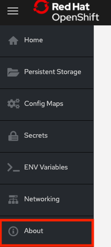

### Resources

- The source code for this app is available here: <https://github.com/openshift-cs/ostoy>
- OSToy front-end container image: <https://quay.io/ostoylab/ostoy-frontend>
- OSToy microservice container image: <https://quay.io/ostoylab/ostoy-microservice>
- Deployment Definition YAMLs:
	-  <a href="yaml/ostoy-fe-deployment.yaml" target="_blank">ostoy-fe-deployment.yaml</a>
	-  <a href="yaml/ostoy-microservice-deployment.yaml" target="_blank">ostoy-microservice-deployment.yaml</a>

> **Note** In order to simplify the deployment of the app we have included all the objects needed in the above YAMLs as "all-in-one" YAMLs.  Though in reality, an enterprise would most likely want to have a different yaml file for each Kubernetes object.

### About OSToy

OSToy is a simple Node.js application that we will deploy to OpenShift Dedicated. It is used to help us explore the functionality of Kubernetes. This application has a user interface where you can:

- write messages to the log (stdout / stderr)
- intentionally crash the application to view self-healing
- toggle a liveness probe and monitor OpenShift behavior
- read config maps, secrets, and env variables
- if connected to shared storage, read and write files
- check network connectivity, intra-cluster DNS, and intra-communication with an included microservice
- increase the load to view automatic scaling of the pods to handle the load (via the Horizontal Pod Autoscaler)

### OSToy Application Diagram

### Familiarization with the Application UI

1. Shows the pod name that served your browser the page.
2. **Home:** The main page of the application where you can perform some of the functions listed which we will explore.
3. **Persistent Storage:**  Allows us to write data to the persistent volume bound to this application.
4. **Config Maps:**  Shows the contents of configmaps available to the application and the key:value pairs.
5. **Secrets:** Shows the contents of secrets available to the application and the key:value pairs.
6. **ENV Variables:** Shows the environment variables available to the application.
7. **Networking:** Tools to illustrate networking within the application.
8. **Auto Scaling:** Tool to increase the load of the pods and test the HPA.
9. Shows some more information about the application.

### Learn more about the application

To learn more, click on the "About" menu item on the left once we deploy the app.

