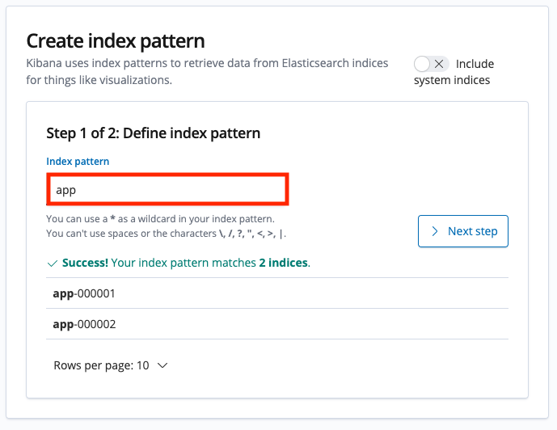

We will take a look at the available options for logging in OpenShift Dedicated (OSD). In this section we will take a look at two methods with which one can view application logs. First, we will look at the logs directly through the pod using `oc logs`.  Second, we will use Kibana to search our logs.

The cluster logging components are based upon Elasticsearch, Fluentd, and Kibana (EFK). The collector, Fluentd, is deployed to each node in the OpenShift Dedicated cluster. It collects application logs and writes them to Elasticsearch (ES). Kibana is the centralized, web UI where users and administrators can create rich visualizations and dashboards with the aggregated data.

### Setup index pattern

Before we get started with the exercise, we need to [create an index pattern in Kibana](https://docs.openshift.com/container-platform/4.7/logging/cluster-logging-deploying.html#cluster-logging-visualizer-indices_cluster-logging-deploying):

- Click on the **Console** link, select the **Application Launcher**, and click on **Logging**

	

- Set **Index pattern** to `app` and click **Next step**

	
	
- Set the **Time filter field name** to `@timestamp` and click **Create index pattern**

	


### Output data to the streams/logs

#### 1. Output a message to *stdout* 

Back in the [OSToy App](http://ostoy-route-%username%-ostoy.%cluster_subdomain%), click on the *Home* menu item and then click in the message box for "Log Message (stdout)" and write any message you want to output to the *stdout* stream.  You can try "**All is well!**".  Then click "Send Message".


#### 2. Output a message to *stderr*

Click in the message box for "Log Message (stderr)" and write any message you want to output to the *stderr* stream. You can try "**Oh no! Error!**".  Then click "Send Message".


### Viewing pod logs

#### 3. Retrieve front end pod name

Go to the CLI and enter the following command to retrieve the name of your frontend pod which we will use to view the pod logs:

```execute
oc get pods -o name
```

```shell
pod/ostoy-frontend-679cb85695-5cn7x
pod/ostoy-microservice-86b4c6f559-p594d
```

So the pod name in this case is **ostoy-frontend-679cb85695-5cn7x**.  

#### 4. Retrieve the logs from the pod

Run

```execute
oc logs -l app=ostoy-frontend
```

And you should see your messages:

```shell
[...]
ostoy-frontend-679cb85695-5cn7x: server starting on port 8080
Redirecting to /home
stdout: All is well!
stderr: Oh no! Error!
```

You should see both the *stdout* and *stderr* messages.

### Using Kibana to search logs

#### 5. View the Kibana console

In the OpenShift Web Console, launch Kibana by selecting the **Application Launcher**, and clicking on **Logging**.


#### 6. Familiarization with the data

In the main part of the console you should see three entries. These will contain what we saw in the above section (viewing through the pods).  You will see the *stdout* and *stderr* messages that we inputted earlier (though you may not see it right away as we might have to filter for it).  In addition to the log output you will see information about each entry.  You can see things like:
- namespace name
- pod name
- host ip address
- timestamp
- log level
- message


You will also see that there is data from multiple sources and multiple messages.  In the image below you can see that 
- A) shows the message we outputted to the *stdout*
- B) shows what our frontend pod received from the microservice (which pod sent it and what color was sent)  
- C) shows what color the microservice pod is responding with


Furthermore, if you wanted to see the data in tabular format or in JSON format you can click on the twisty-tie on the left of the row.


